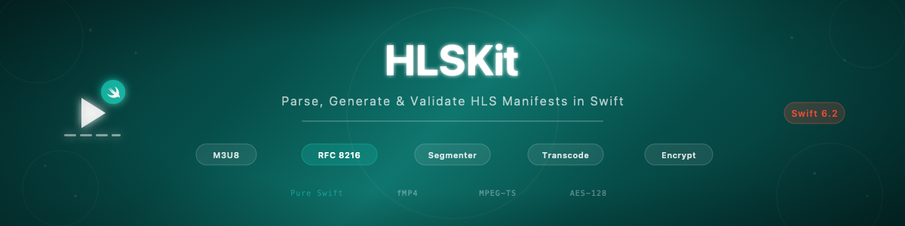

# swift-hls-kit

[](https://github.com/atelier-socle/swift-hls-kit/actions/workflows/ci.yml)
[](https://codecov.io/github/atelier-socle/swift-hls-kit)
[](https://swift.org)
[]()
[](LICENSE)



A pure Swift library for the full HLS pipeline — parse, generate, and validate M3U8 manifests, segment and transcode media, and encrypt segments for delivery. RFC 8216 compliant with strict `Sendable` conformance throughout. Zero external dependencies in the core library (only `swift-argument-parser` for the CLI). Cross-platform: macOS, iOS, tvOS, watchOS, visionOS, and Linux. Suitable for streaming platforms, media servers, podcast apps, and video processing pipelines.

Part of the [Atelier Socle](https://www.atelier-socle.com) ecosystem.

---

## Features

- **Parse** — Full HLS manifest parsing with typed models for master and media playlists, including Low-Latency HLS extensions
- **Generate** — Produce spec-compliant M3U8 output with imperative API and `@resultBuilder` DSL
- **Validate** — Check conformance against RFC 8216 and Apple HLS rules with 3 severity levels
- **Segment (fMP4)** — Split MP4 files into fragmented MP4 segments with init segment and auto-generated playlist
- **Segment (MPEG-TS)** — Split MP4 files into MPEG-TS segments for legacy compatibility
- **Byte-range** — Single-file byte-range segmentation mode
- **Transcode (Apple)** — Hardware-accelerated encoding via Apple VideoToolbox
- **Transcode (FFmpeg)** — Cross-platform transcoding with quality presets and multi-variant output
- **Cloud Transcode** — Delegate to Cloudflare Stream, AWS MediaConvert, or Mux via `ManagedTranscoder` — same `Transcoder` protocol, zero local GPU required
- **Encrypt (AES-128)** — Full-segment AES-128-CBC encryption with key rotation
- **Encrypt (SAMPLE-AES)** — Sample-level encryption for video NAL units and audio ADTS frames
- **Key management** — Key generation, IV derivation (RFC 8216), and key file I/O
- **MP4 inspection** — Container-level MP4 box reading, track analysis, and sample table parsing
- **CLI** — `hlskit-cli` command-line tool with 6 commands for common HLS workflows
- **Strict concurrency** — All public types are `Sendable`, built with Swift 6.2 strict concurrency throughout

---

## Installation

### Requirements

- **Swift 6.2+** with strict concurrency
- **Library platforms**: macOS 14+, iOS 17+, tvOS 17+, watchOS 10+, visionOS 1+
- **CLI platforms**: macOS 14+, Linux
- **Zero third-party dependencies** in the core library (`swift-argument-parser` for CLI only)

### Swift Package Manager

Add the dependency to your `Package.swift`:

```swift
dependencies: [
    .package(url: "https://github.com/atelier-socle/swift-hls-kit.git", from: "0.3.0")
]
```

Then add it to your target:

```swift
.target(
    name: "YourTarget",
    dependencies: ["HLSKit"]
)
```

---

## Quick Start

```swift
import HLSKit

let engine = HLSEngine()

// 1. Parse a manifest
let m3u8 = """
    #EXTM3U
    #EXT-X-VERSION:7
    #EXT-X-STREAM-INF:BANDWIDTH=800000,RESOLUTION=640x360,CODECS="avc1.4d401e,mp4a.40.2"
    360p/playlist.m3u8
    #EXT-X-STREAM-INF:BANDWIDTH=2800000,RESOLUTION=1280x720,CODECS="avc1.4d401f,mp4a.40.2"
    720p/playlist.m3u8
    """

let manifest = try engine.parse(m3u8)

// 2. Validate against RFC 8216
let report = engine.validate(manifest)
print("Valid: \(report.isValid)")

// 3. Segment an MP4 file
let config = SegmentationConfig(containerFormat: .fragmentedMP4, generatePlaylist: true)
let result = try engine.segment(data: mp4Data, config: config)
print("Segments: \(result.segmentCount), Duration: \(result.totalDuration)s")
```

---

## Key Concepts

### Parsing Manifests

```swift
let parser = ManifestParser()
let manifest = try parser.parse(m3u8String)

guard case .master(let playlist) = manifest else { return }
for variant in playlist.variants {
    print("\(variant.resolution) — \(variant.bandwidth) bps")
}
```

### Generating Manifests

Build playlists with the `@resultBuilder` DSL:

```swift
let playlist = MasterPlaylist {
    Variant(bandwidth: 800_000, resolution: .p480, uri: "480p/playlist.m3u8")
    Variant(bandwidth: 2_800_000, resolution: .p720, uri: "720p/playlist.m3u8")
    Variant(bandwidth: 5_000_000, resolution: .p1080, uri: "1080p/playlist.m3u8")
}

let m3u8 = ManifestGenerator().generateMaster(playlist)
```

Or use the imperative API:

```swift
let playlist = MediaPlaylist(targetDuration: 6, playlistType: .vod, hasEndList: true, segments: [
    Segment(duration: 6.006, uri: "segment000.ts"),
    Segment(duration: 5.839, uri: "segment001.ts")
])
let m3u8 = ManifestGenerator().generateMedia(playlist)
```

### Validation

```swift
let report = HLSValidator().validate(playlist)
print("Errors: \(report.errors.count), Warnings: \(report.warnings.count)")
```

### Segmentation

```swift
let config = SegmentationConfig(
    targetSegmentDuration: 6.0,
    containerFormat: .fragmentedMP4,
    generatePlaylist: true
)
let result = try MP4Segmenter().segment(data: mp4Data, config: config)
// result.initSegment, result.mediaSegments, result.playlist
```

### Transcoding

```swift
let transcoder = AppleTranscoder()
let result = try await transcoder.transcode(
    input: inputURL, outputDirectory: outputURL,
    config: TranscodingConfig(), progress: { print("\($0 * 100)%") }
)
```

Quality presets: `.p360`, `.p480`, `.p720`, `.p1080`, `.p2160`, `.audioOnly`

### Cloud Transcoding

For server-side applications where local GPU or FFmpeg are not available, `ManagedTranscoder` delegates to cloud providers while conforming to the same `Transcoder` protocol. Upload and download stream data to/from disk without loading entire files into memory.

```swift
let config = ManagedTranscodingConfig(
    provider: .cloudflareStream,
    apiKey: "cf-api-token",
    accountID: "cf-account-123"
)
let transcoder = ManagedTranscoder(config: config)

let result = try await transcoder.transcode(
    input: inputURL, outputDirectory: outputDir,
    config: TranscodingConfig(),
    progress: { print("\($0 * 100)%") }
)
```

| Provider | Authentication | Best For |
|---|---|---|
| Cloudflare Stream | API token (Bearer) | Zero egress costs, global CDN |
| AWS MediaConvert | Access key + secret (SigV4) | Enterprise, existing AWS infra |
| Mux | Token ID + secret (Basic Auth) | Simplest API, auto-adaptive bitrate |

Features: streaming upload/download (no full file in RAM), granular progress through 5 phases (upload, job creation, polling, download, complete), configurable quality presets (`.p360` to `.p2160`, `.audioOnly`), automatic cloud asset cleanup.

### Encryption

```swift
let key = try KeyManager().generateKey()
let iv = try KeyManager().generateIV()
let encrypted = try SegmentEncryptor().encrypt(segmentData: data, key: key, iv: iv)
let decrypted = try SegmentEncryptor().decrypt(segmentData: encrypted, key: key, iv: iv)
```

---

## Architecture

```
Sources/
├── HLSKit/                 # Core library (zero dependencies)
│   ├── Manifest/           # Models (MasterPlaylist, MediaPlaylist, Variant, Segment, ...)
│   ├── Parser/             # ManifestParser, TagParser, AttributeParser
│   ├── Generator/          # ManifestGenerator, TagWriter
│   ├── Builder/            # @resultBuilder DSL for playlists
│   ├── Validator/          # HLSValidator, RFC 8216 + Apple HLS rules
│   ├── Segmenter/          # MP4Segmenter, TSSegmenter
│   ├── Transcoder/         # AppleTranscoder, FFmpegTranscoder, ManagedTranscoder, QualityPreset
│   ├── Encryption/         # SegmentEncryptor, SampleEncryptor, KeyManager
│   ├── Container/          # MP4BoxReader, MP4InfoParser, BinaryReader/Writer
│   ├── Transport/          # TSSegmentBuilder, TSPacket, PESPacketizer, ADTSConverter
│   ├── Engine/             # HLSEngine facade
│   └── Documentation.docc/ # 11 DocC articles
├── HLSKitCommands/         # CLI command implementations
└── HLSKitCLI/              # CLI entry point (@main)
```

---

## CLI

### Installation

```bash
swift build -c release
cp .build/release/hlskit-cli /usr/local/bin/
```

### Usage

```bash
# Inspect a file
hlskit-cli info video.mp4
hlskit-cli info playlist.m3u8 --output-format json

# Segment an MP4
hlskit-cli segment video.mp4 --output /tmp/hls/ --format fmp4 --duration 6

# Transcode to multiple variants
hlskit-cli transcode video.mp4 --presets 360p,720p,1080p

# Validate a playlist
hlskit-cli validate playlist.m3u8 --strict

# Encrypt segments
hlskit-cli encrypt /tmp/hls/ --key-url "https://cdn.example.com/key" --write-key

# Parse or generate manifests
hlskit-cli manifest parse playlist.m3u8
hlskit-cli manifest generate /tmp/hls/
```

### Commands

| Command | Description |
|---------|-------------|
| `info` | Inspect MP4 or M3U8 files (tracks, codec, duration, segments) |
| `segment` | Split MP4 files into fMP4 or MPEG-TS segments |
| `transcode` | Transcode media to one or more HLS quality variants |
| `validate` | Validate M3U8 playlists against RFC 8216 and Apple HLS rules |
| `encrypt` | Encrypt HLS segments with AES-128 or SAMPLE-AES |
| `manifest` | Parse or generate M3U8 manifests (2 subcommands: `parse`, `generate`) |

---

## Test Suite

The project includes a comprehensive test suite using Swift Testing (`import Testing`):

| Category | Focus |
|----------|-------|
| Model | Type conformances, Codable round-trip, HLS models |
| Parser | Master/media playlists, LL-HLS, byte-range, encryption tags |
| Generator | M3U8 output, builder DSL, tag writing |
| Validator | RFC 8216, Apple HLS rules, severity levels |
| Segmenter | fMP4, MPEG-TS, byte-range, config, playlist generation |
| Transcoder | Quality presets, Apple/FFmpeg/Managed availability, multi-variant |
| Encryption | AES-128, SAMPLE-AES, key management, round-trip |
| Container | MP4 box reading, sample tables, init/media segment writing |
| Transport | TS packets, PAT/PMT, PES, ADTS/AnnexB conversion |
| Engine | HLSEngine facade, segmentation, encryption, manifest ops |
| Showcase | Public API demonstrations (executable documentation) |
| CLI | All 6 commands, argument parsing, integration |

All tests run on macOS in CI. No XCTest — 100% Swift Testing.

---

## Documentation

Full API documentation is available as a DocC catalog bundled with the package. Open the project in Xcode and select **Product > Build Documentation** to browse it locally.

The catalog includes 11 guides:

| Guide | Content |
|-------|---------|
| Getting Started | Installation, first workflow, builder DSL |
| Manifest Parsing | ManifestParser, TagParser, AttributeParser, error handling |
| Manifest Generation | ManifestGenerator, TagWriter, builder DSL, LL-HLS models |
| Validating Manifests | HLSValidator, rule sets, severity levels, reports |
| Segmenting Media | MP4Segmenter, TSSegmenter, byte-range, config |
| Transcoding Media | Quality presets, Apple/FFmpeg transcoders, multi-variant |
| Cloud Transcoding | ManagedTranscoder, Cloudflare/AWS/Mux providers, streaming upload |
| Encrypting Segments | AES-128, SAMPLE-AES, KeyManager, EncryptionConfig |
| HLSEngine | High-level facade for end-to-end workflows |
| CLI Reference | 6 commands with options, examples, JSON config |

---

## Specification References

- [RFC 8216 — HTTP Live Streaming](https://datatracker.ietf.org/doc/html/rfc8216)
- [Apple HLS Authoring Specification](https://developer.apple.com/documentation/http-live-streaming/hls-authoring-specification-for-apple-devices)
- [Pantos HLS Draft](https://datatracker.ietf.org/doc/html/draft-pantos-hls-rfc8216bis)
- [ISO 14496-12 — ISO Base Media File Format](https://www.iso.org/standard/68960.html)
- [ISO 13818-1 — MPEG-TS](https://www.iso.org/standard/69461.html)

---

## Contributing

See [CONTRIBUTING.md](CONTRIBUTING.md) for guidelines on how to contribute.

---

## License

This project is licensed under the [Apache License 2.0](LICENSE).

Copyright 2026 [Atelier Socle SAS](https://www.atelier-socle.com). See [NOTICE](NOTICE) for details.
